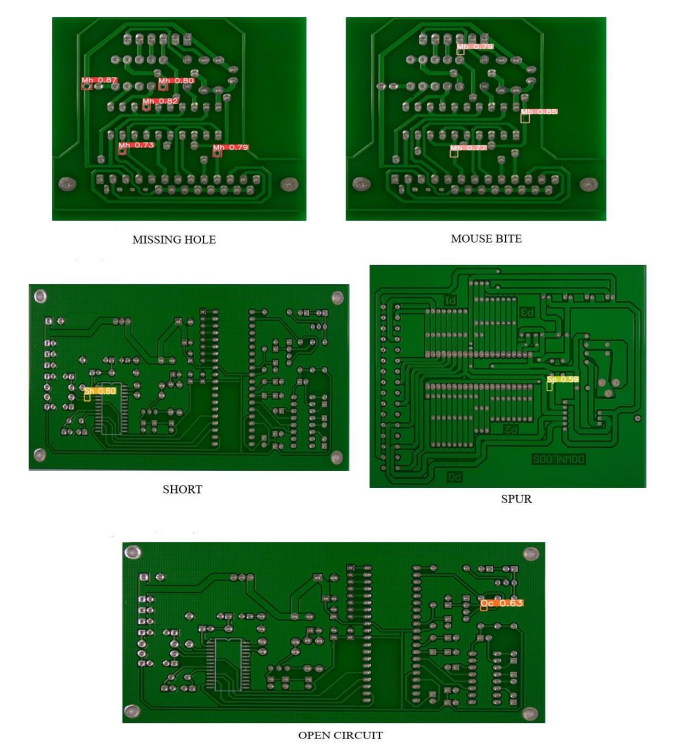
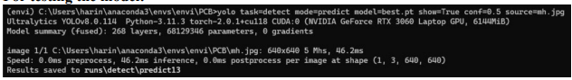
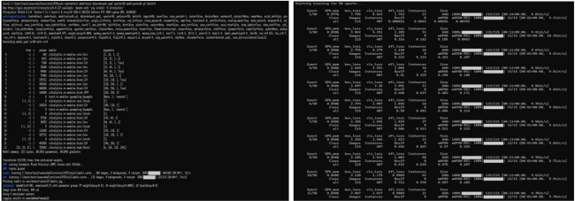
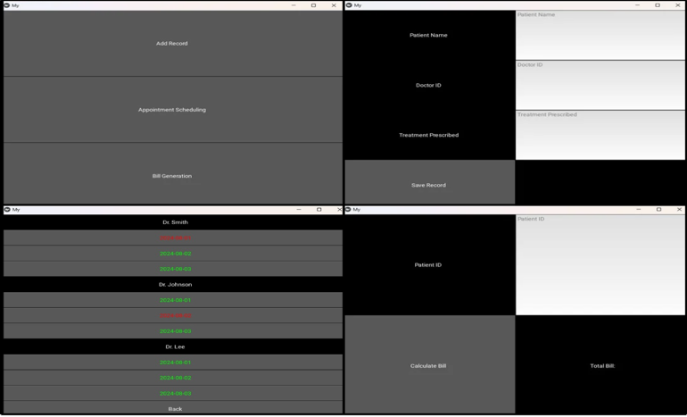

# Python-projects

# Welcome to My GitHub Profile!

## Featured Projects

### 1. [PCB Fault Detection with YOLOv8](https://github.com/HariniV2907/PCB_Fault_Detection)

This project leverages the YOLOv8 algorithm to automatically identify and classify faults on Printed Circuit Boards (PCBs). The implementation focuses on enhancing the detection speed and accuracy, making it a valuable tool for quality control in electronics manufacturing.

**Key Features:**
- Automatic identification of PCB faults.
- High-speed detection with YOLOv8.
- Improved accuracy in fault classification.

**Images:**
- 
- 
- 

**Plugins Used:**
- **External Plugins:** YOLOv8 for object detection.
- **Internal Plugins:** Custom data preprocessing and post-processing scripts to optimize detection performance.

---

### 2. [Hospital Management System using Machine Learning & Blockchain (HM-BML)](https://github.com/HariniV2907/HM-BML)

The Hospital Management System (HM-BML) project integrates Machine Learning and Blockchain technologies to securely store and manage hospital records. This system aims to provide a reliable, tamper-proof solution for managing sensitive patient data.

**Key Features:**
- Secure storage of hospital records.
- Integration of Machine Learning for data analysis.
- Blockchain technology for tamper-proof records.

**Image:**
- 

**Plugins Used:**
- **External Plugins:** Blockchain libraries for secure data management.
- **Internal Plugins:** Machine Learning models for analyzing patient data and enhancing decision-making processes.

---

